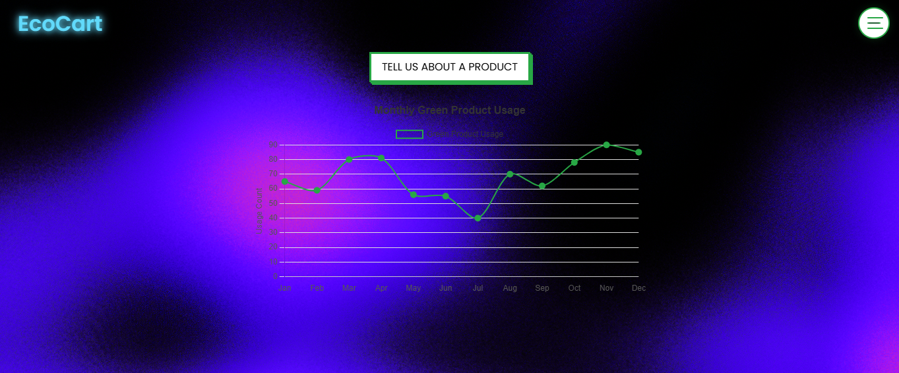

<!DOCTYPE html>
<html lang="en">
<body>

  <h1>♻️ EcoCart Dashboard</h1>

  
<strong>EcoCart</strong> is an eco-conscious web dashboard that empowers users to track, analyze, and enhance their sustainability efforts through green product usage. With a stylish UI, immersive 3D background, and interactive charts, it brings a fun and educational twist to going green. 🌿

  

  

  <h2>🌟 Features</h2>
  <ul>
    <li>🧠 <strong>AI-Driven Modal Input</strong> — Users can input product details to receive eco-friendly suggestions.</li>
    <li>🌱 <strong>Eco Suggestions Modal</strong> — Displays handpicked green alternatives.</li>
    <li>📈 <strong>Usage Analytics Chart</strong> — Visualize monthly eco-product usage via Chart.js.</li>
    <li>🧼 <strong>3D Interactive Background</strong> — Built with Spline for a smooth, futuristic aesthetic.</li>
    <li>🔒 <strong>Responsive Off-Canvas Menu</strong> — Clean and accessible navbar with animated hamburger → X button.</li>
    <li>💡 <strong>Typing Overlay Animation</strong> — Welcoming splash screen with fade transitions and typing effects.</li>
  </ul>

  

  <h2>🛠️ Tech Stack</h2>

  <table>
    <thead>
      <tr>
        <th>Frontend</th>
        <th>Libraries</th>
        <th>UI / Animations</th>
      </tr>
    </thead>
    <tbody>
      <tr>
        <td>HTML5 / CSS3 / JS</td>
        <td>Bootstrap 5.3, Chart.js</td>
        <td>Spline 3D, Google Fonts (Poppins), Custom CSS Animations</td>
      </tr>
    </tbody>
  </table>

  

  <h2>📸 UI Preview</h2>
  

    📊 Dashboard with Line Chart 
    🧴 Modal for Eco-Friendly Suggestions 
    🌍 Spline 3D Animated Background
  

</body>
</html>
